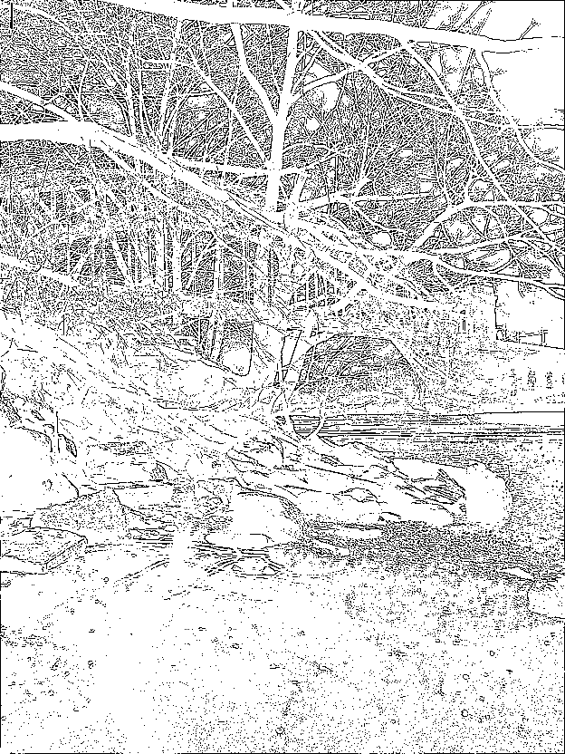

# aquarelle
Extract a line drawing from a picture.

# Use cases:
 * Create a coloring book
 * Using a projector, display the outline of a picture to paint it on a wall
 * Data augmentation
 * Others?

---
## Usage:
```
from aquarelle import process as aqua

# Using the sample file:
sample = aqua.SAMPLE_FILE

outline, outfile = aqua.image_to_edges(sample,
                                       rotate_angle=270,
                                       save_file=True,
                                       output_filename="./sample_lines.png")

#outline.show()  # this method will launch the system image viewer

# or:
from IPython.display import Image as Image

Image(filename=outfile)
```
### Output:



## See `/notebooks/Example.ipynb` or `/notebooks/Example.md` for processing an entire folder.  

# Happy painting!

---


